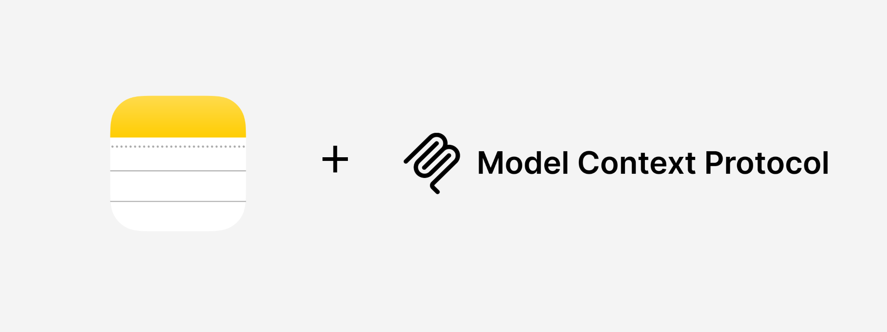

# Apple Notes MCP Server



A Model Context Protocol (MCP) server that provides CRU(D) tools for Apple Notes using AppleScript integration. This server allows you to create, read, and update notes and folders in the Apple Notes app on your MacOS devices directly from MCP-compatible AI assistants.

## Table of Contents

- [Features](#features)
- [Prerequisites](#prerequisites)
- [Installation](#installation)
- [Usage](#usage)
  - [Starting the Server](#starting-the-server)
  - [Available Tools](#available-tools)
- [Configuration](#configuration)
  - [MCP Client Configuration](#mcp-client-configuration)
- [Examples](#examples)
- [Troubleshooting](#troubleshooting)
- [License](#license)

## Features

### Note Tools

- **Create notes** - Add new notes with title and content
- **List notes** - Get all notes or notes in a specific folder
- **Get note content** - Retrieve the full content of a specific note
- **Update note content** - Modify the body of existing notes
- **Update note title** - Rename existing notes
- **Search notes** - Find notes by content or title

### Folder Tools

- **Create folders** - Add new folders to organize notes
- **List folders** - Get all available folders
- **Get folder info** - Get folder details including note count
- **Move notes** - Move notes between folders

## Prerequisites

- **macOS** - This tool only works on macOS as it interacts with Apple Notes
- **Python 3.12+** - Required for running the server
- **uv** - Python package manager (recommended for easier setup)
- **Apple Notes** - Must be installed and accessible on your Mac

## Installation

1. **Clone the repository:**

   ```bash
   git clone <repository-url>
   cd apple-notes-mcp
   ```

2. **Set up Python environment and install dependencies:**

   ```bash
   uv venv
   uv sync
   ```

## Usage

### Starting the Server

To start the server manually, run:

```bash
uv run src/apple_notes_mcp/server.py
```

The server will listen for MCP requests via stdio.

### Available Tools

#### Note Management

- `create_note(title, content, folder=None)` - Create a new note
  - `title`: The title/name of the note
  - `content`: The content/body of the note
  - `folder`: Optional folder name to create the note in

- `list_notes(folder=None)` - List all notes or notes in a folder
  - `folder`: Optional folder name to filter notes by

- `get_note_content(note_name)` - Get the content of a specific note
  - `note_name`: The name of the note to retrieve

- `update_note_content(note_name, new_content)` - Update note content
  - `note_name`: The name of the note to update
  - `new_content`: The new content for the note

- `update_note_title(old_name, new_name)` - Rename a note
  - `old_name`: The current name of the note
  - `new_name`: The new name for the note

- `search_notes(search_term)` - Search for notes containing a term
  - `search_term`: The term to search for in note titles and content

#### Folder Management

- `create_folder(folder_name)` - Create a new folder
  - `folder_name`: The name of the folder to create

- `list_folders()` - List all folders

- `get_folder_info(folder_name)` - Get folder information
  - `folder_name`: The name of the folder

- `move_note_to_folder(note_name, folder_name)` - Move a note to a folder
  - `note_name`: The name of the note to move
  - `folder_name`: The name of the target folder

## Configuration

### MCP Client Configuration

To use this server with an MCP client (like Claude Desktop), add the following to your MCP configuration:

```json
{
  "mcpServers": {
    "apple-notes": {
      "command": "uv",
      "args": [
        "run",
        "--directory",
        "/path/to/apple-notes-mcp",
        "src/apple_notes_mcp/server.py"
      ]
    }
  }
}
```

Replace `/path/to/apple-notes-mcp` with the actual path to your cloned repository.

For Claude Desktop on macOS, this configuration typically goes in:
`~/Library/Application Support/Claude/claude_desktop_config.json`

## Examples

Here are some example prompts you can use with an MCP-compatible AI assistant:

1. "Create a new note titled 'Meeting Notes' with content 'Discussed project timeline and deliverables'"
2. "List all my notes in the 'Work' folder"
3. "Get the content of my note 'Shopping List'"
4. "Update the note 'Project Ideas' with new content about our app concept"
5. "Rename the note 'Old Title' to 'New Title'"
6. "Search for notes containing 'important'"
7. "Create a new folder called 'Personal'"
8. "Move the note 'Recipe Ideas' to the 'Personal' folder"
9. "Show me information about the 'Work' folder"

## Troubleshooting

1. **AppleScript Error**: Make sure Apple Notes is accessible and you've granted necessary permissions to your terminal/IDE in System Preferences > Security & Privacy > Privacy > Automation.

2. **Permission Issues**: If you encounter permission errors, you may need to grant accessibility permissions to your terminal application.

3. **Notes Not Found**: Ensure the note names you're using match exactly, including capitalization and special characters.

4. **Folder Issues**: Make sure folders exist before trying to move notes to them or list notes within them.

5. **Python Environment**: If you encounter Python import errors, make sure you've run `uv sync` and are using the correct Python environment.

## License

This project is licensed under the MIT License - see the [LICENSE](LICENSE) file for details.
